  
# 👋 Hello, I'm TechGenDM

  

 

## 🚀 About Me

> **"Code is poetry, and I'm a poet building the future"**

I'm a passionate **Full-Stack Developer** and **AI Enthusiast** who believes in turning innovative ideas into reality. Currently on a **lifelong journey** of building impactful projects, learning cutting-edge technologies, and contributing to the open-source community.

### 🌟 What Drives Me
- 🔮 **Innovation**: Always exploring the latest in AI, Web3, and emerging technologies  
- 🎯 **Impact**: Building solutions that make a real difference in people's lives
- 🌱 **Growth**: Committed to continuous learning and skill enhancement
- 🤝 **Community**: Sharing knowledge and collaborating with fellow developers

## 💼 Current Focus

<table>
<tr>
<td width="50%">

### 🔥 Active Projects
- **🤖 Gemini AI Clone** - Advanced conversational AI interface
- **🌐 Portfolio Website** - Showcase of my development journey  
- **📱 Mobile Apps** - React Native & Flutter experiments
- **🔗 Web3 DApps** - Blockchain integration projects

</td>
<td width="50%">

### 🎓 Learning Path
- **Advanced React Patterns** & **Next.js 14**
- **Machine Learning** with **TensorFlow.js**
- **Cloud Architecture** - **AWS** & **Google Cloud**
- **DevOps** & **Container Technologies**

</td>
</tr>
</table>

## 🛠️ Tech Arsenal

### Frontend Mastery

### Backend & Database

### AI, ML & Data Science

### DevOps & Tools

## 📊 GitHub Analytics

  
<table>
<tr>
<td width="50%">

</td>
<td width="50%">

</td>
</tr>
</table>

## 🏆 Featured Projects

<table>
<tr>
<td width="50%">

### 🤖 [Gemini AI Clone](https://github.com/TechGenDM/GEMINI-CLONE--React.Js-)
**React.js • Vite • AI Integration**

A sophisticated AI chatbot interface built with modern React, featuring:
- 🎨 Pixel-perfect UI design
- ⚡ Lightning-fast Vite development
- 🧠 Google Gemini API integration
- 📱 Fully responsive design

</td>
<td width="50%">

### 🚀 [Project Coming Soon]
**Next.js • TypeScript • AI**

Revolutionary project in development:
- 🌟 Cutting-edge technology stack
- 🔥 Innovative features
- 🎯 Real-world impact
- 📈 Scalable architecture

</td>
</tr>
</table>

## 🎯 2025 Goals & Vision

```mermaid
graph LR
    A[🎯 Goals] --> B[Open Source]
    A --> C[AI Mastery]
    A --> D[Community]
    A --> E[Innovation]
    
    B --> B1[100+ Contributions]
    C --> C1[ML Certification]
    D --> D1[Tech Speaking]
    E --> E1[Startup Launch]
```

### 🌟 Mission Statement
> **Building tomorrow's technology today** - Creating innovative solutions that bridge the gap between complex AI capabilities and intuitive user experiences.

## 📈 GitHub Activity

  

## 🌐 Connect & Collaborate

### Let's build something amazing together! 🚀

### 💡 Open to:
- **Freelance Projects** • **Open Source Collaboration** • **Tech Discussions** • **Mentoring**

 

**⭐ If you find my work interesting, consider giving my repositories a star!**

  
### 🎨 "Code is not just about solving problems, it's about crafting digital experiences that inspire and empower."

