<!-- Header with animated background -->

<!-- Glitch effect title -->
<h1 align="center">
  
  
</h1>

<!-- Neon divider -->

<!-- Interactive profile badges -->

  
  
  

<!-- Animated separator -->

 

<!-- About section with glassmorphism effect -->

  
## 🌟 About My Digital Journey

> *"In the intersection of **code**, **data**, and **imagination**, I craft digital experiences that push the boundaries of what's possible."*

 

**🚀 I'm a Multi-Dimensional Developer** specializing in:
- **🧠 AI & Machine Learning** - Turning data into intelligent insights
- **🌐 Full-Stack Development** - Creating seamless digital experiences  
- **📊 Data Science** - Uncovering patterns that drive innovation
- **🔮 Emerging Tech** - Always at the forefront of technological evolution

<!-- Animated coding GIF -->

<!-- Advanced separator with particles -->

## 🎯 Current Universe

<table style="background: linear-gradient(45deg, #1a1b27, #2d2b55); border-radius: 15px; overflow: hidden;">
<tr>
<td width="50%" style="padding: 20px;">

### 🔥 **Active Creations**

- **🤖 Gemini AI Clone** - Next-gen conversational AI interface
- **📊 ML Analytics Dashboard** - Python-powered insights engine  
- **🌐 Dynamic Portfolio** - Showcase of innovation journey
- **📱 Cross-Platform Apps** - React Native & Flutter masterpieces
- **🔗 Blockchain DApps** - Web3 integration experiments
- **🧪 AI Research Projects** - Experimental ML models

</td>
<td width="50%" style="padding: 20px;">

### 🎓 **Learning Frontier**

- **🚀 Advanced React Ecosystem** - Next.js 14, Server Components
- **🧠 Deep Learning Mastery** - TensorFlow, PyTorch, Neural Networks
- **☁️ Cloud Architecture** - AWS, GCP, Serverless Computing
- **🔧 MLOps & DataOps** - Model deployment & data pipelines
- **🌊 Real-time Analytics** - Streaming data & live insights
- **🤖 Generative AI** - LLMs, Computer Vision, NLP

</td>
</tr>
</table>

<!-- Tech stack with modern styling -->

## 💻 **Tech Arsenal** 

<!-- Frontend Section -->

<h3 style="display: inline;">🨠Frontend Mastery</h3>

 

<!-- Backend Section -->

<h3 style="display: inline;">⚡ Backend & Database</h3>

 

<!-- AI/ML Section -->

<h3 style="display: inline;">🧠 AI, ML & Data Science</h3>

 

<!-- Cloud & DevOps Section -->

<h3 style="display: inline;">☁️ Cloud & DevOps</h3>

 

<!-- Dynamic separator -->

## 📊 **Performance Analytics**

<!-- GitHub Stats Cards with enhanced styling -->

<!-- Language stats with futuristic design -->

<!-- Activity graph -->

<!-- Futuristic separator -->

## 🚀 **Featured Universe**

<table style="width: 100%; background: linear-gradient(135deg, #0d1117, #1a1b27); border-radius: 20px; overflow: hidden;">
<tr>
<td width="50%" style="padding: 30px; border-right: 1px solid rgba(255,255,255,0.1);">

### 🤖 **[Gemini AI Clone](https://github.com/TechGenDM/GEMINI-CLONE--React.Js-)**
**React.js • Vite • AI Integration • Modern UI**

🎯 **Features:**
- 🎨 Pixel-perfect modern UI design
- ⚡ Lightning-fast Vite development
- 🧠 Google Gemini API integration
- 📱 Fully responsive & accessible
- ✨ Smooth animations & transitions
- 🔐 Secure API handling

</td>
<td width="50%" style="padding: 30px;">

### 🔮 **[Next Innovation]**
**Next.js • AI • Blockchain • Future Tech**

🚀 **Upcoming:**
- 🌟 Revolutionary AI-powered platform
- 🔥 Cutting-edge user experience
- 🎯 Real-world problem solving
- 📈 Scalable microservices architecture
- 🌐 Global impact potential
- 🔬 Experimental technology integration

</td>
</tr>
</table>

<!-- Holographic separator -->

## 🎯 **2025 Vision Board**

```mermaid
graph TD
    A[🎯 2025 Goals] --> B[🌟 Open Source Impact]
    A --> C[🧠 AI Mastery]
    A --> D[🌐 Community Building]
    A --> E[🚀 Innovation Labs]
    
    B --> B1[💯 500+ Contributions]
    B --> B2[📦 Popular npm packages]
    
    C --> C1[🏆 ML Certifications]
    C --> C2[🤖 AI Product Launch]
    
    D --> D1[🎤 Tech Conference Speaker]
    D --> D2[👥 Mentorship Program]
    
    E --> E1[🏢 Startup Launch]
    E --> E2[💡 Patent Applications]
    
    style A fill:#00D9FF,stroke:#fff,stroke-width:3px,color:#000
    style B fill:#FF6B6B,stroke:#fff,stroke-width:2px,color:#fff
    style C fill:#4ECDC4,stroke:#fff,stroke-width:2px,color:#fff
    style D fill:#45B7D1,stroke:#fff,stroke-width:2px,color:#fff
    style E fill:#96CEB4,stroke:#fff,stroke-width:2px,color:#fff
```

### 🌟 **Mission Statement**

> *"At the intersection of **artificial intelligence**, **data science**, and **human creativity**, I build digital experiences that don't just solve problems—they inspire possibilities and shape the future of human-computer interaction."*

**🎯 Core Values:**
`Innovation` • `Impact` • `Intelligence` • `Inspiration` • `Inclusion`

<!-- Dynamic metrics -->

## 🌐 **Connect & Collaborate**

### ✨ **Let's Build the Future Together** ✨

<!-- Interactive collaboration badges -->

<!-- Profile views with modern styling -->

<!-- Final quote section -->

### 💫 *"In a world of algorithms and data, I don't just write code—I craft digital poetry that speaks the language of the future."*

**⭐ If my work resonates with you, consider starring my repositories and joining the journey!**

<!-- Footer with wave animation -->

<!-- Hidden ASCII art for terminal users -->
<!--
████████╗███████╗ ██████╗██╗  ██╗ ██████╗ ███████╗███╗   ██╗██████╗ ███╗   ███╗
╚══██╔══╝██╔════╝██╔════╝██║  ██║██╔════╝ ██╔════╝████╗  ██║██╔══██╗████╗ ████║
   ██║   █████╗  ██║     ███████║██║  ███╗█████╗  ██╔██╗ ██║██║  ██║██╔████╔██║
   ██║   ██╔══╝  ██║     ██╔══██║██║   ██║██╔══╝  ██║╚██╗██║██║  ██║██║╚██╔╝██║
   ██║   ███████╗╚██████╗██║  ██║╚██████╔╝███████╗██║ ╚████║██████╔╝██║ ╚═╝ ██║
   ╚═╝   ╚══════╝ ╚═════╝╚═╝  ╚═╝ ╚═════╝ ╚══════╝╚═╝  ╚═══╝╚═════╝ ╚═╝     ╚═╝
-->

